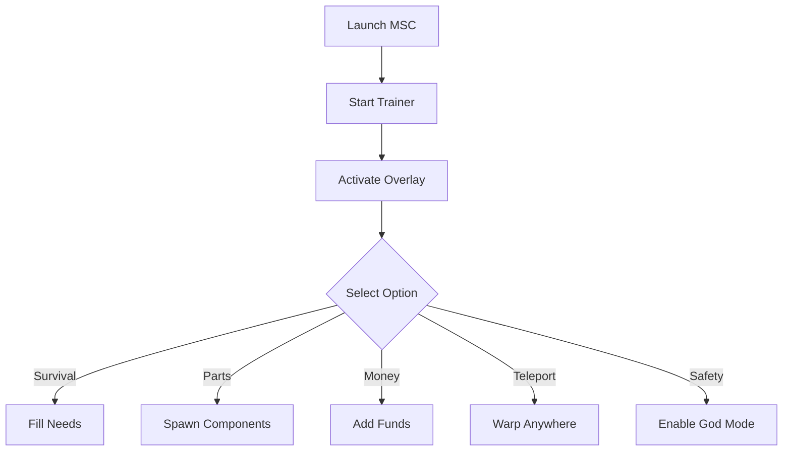

# 🚗 My Summer Car Trainer

**My Summer Car** is both brutal and hilarious: build your car piece by piece, survive off sausages and beer, and hope you don’t die in a ditch. But if you want to skip the grind or just enjoy the sandbox, the **My Summer Car Trainer** is your go-to tool.

With customizable hotkeys and real-time toggles, you can control stats, spawn components, teleport across the map, and even make yourself immortal.

---

## 🔎 Overview

This trainer gives you **instant control** over core game mechanics:

* Add unlimited money or spawn parts on demand
* Toggle god mode to avoid permadeath frustration
* Control hunger, thirst, fatigue, and urine bars instantly
* Teleport anywhere with a single click
* Speed up builds by bypassing repetitive steps

It’s built for both **casual fun** and **hardcore experimentation**.

---

## ⚙️ Key Functions

* **🔩 Part Spawner** – Instantly add missing car components or full assemblies.
* **🍔 Survival Manager** – Keep your meters full (hunger, thirst, fatigue, dirtiness).
* **🛡 God Mode** – Prevent death from crashes, drowning, or hunger.
* **🛰 Map Teleport** – Warp to home, shop, or your car instantly.
* **💸 Infinite Money** – Buy everything from rally parts to food without limits.
* **🎛 Custom Hotkeys** – Remap every trainer feature to your liking.

[!IMPORTANT]
Unlike mods that require loaders, this trainer runs as a **standalone overlay**—no extra installs needed.

---

## 🖥 Compatibility

| Platform       | Status | Notes                     |
| -------------- | ------ | ------------------------- |
| Windows 10/11  | ✅      | Fully supported           |
| Steam Edition  | ✅      | Recommended               |
| Linux (Proton) | ⚠️     | Experimental support only |
| Mac            | ❌      | Not supported             |

---

## ⚡ Setup Instructions

1. Download and extract the trainer.
2. Launch **My Summer Car** first.
3. Run `msc_trainer.exe` as Administrator.
4. Use `F4` to open the in-game trainer overlay.
5. Activate cheats via the menu or hotkeys.

```bash
# Example quick run
msc_trainer.exe --overlay --godmode --money
```

---

## 📊 Feature Workflow



---

## ❓ FAQ

**Q: Will this trainer corrupt saves?**
A: No—all changes are reversible. Saves remain safe.

**Q: Can it run with MSC Mod Loader?**
A: Yes, they work fine together.

**Q: Does it auto-update with patches?**
A: Updates are released after major MSC changes.

**Q: Can I turn cheats off anytime?**
A: Absolutely—everything is toggle-based.

---

## 🚀 Final Thoughts

The **My Summer Car Trainer** is the ultimate way to free yourself from grind. Whether you want to test wacky builds, explore stress-free, or just laugh at chaos with god mode on—this tool makes it possible.
